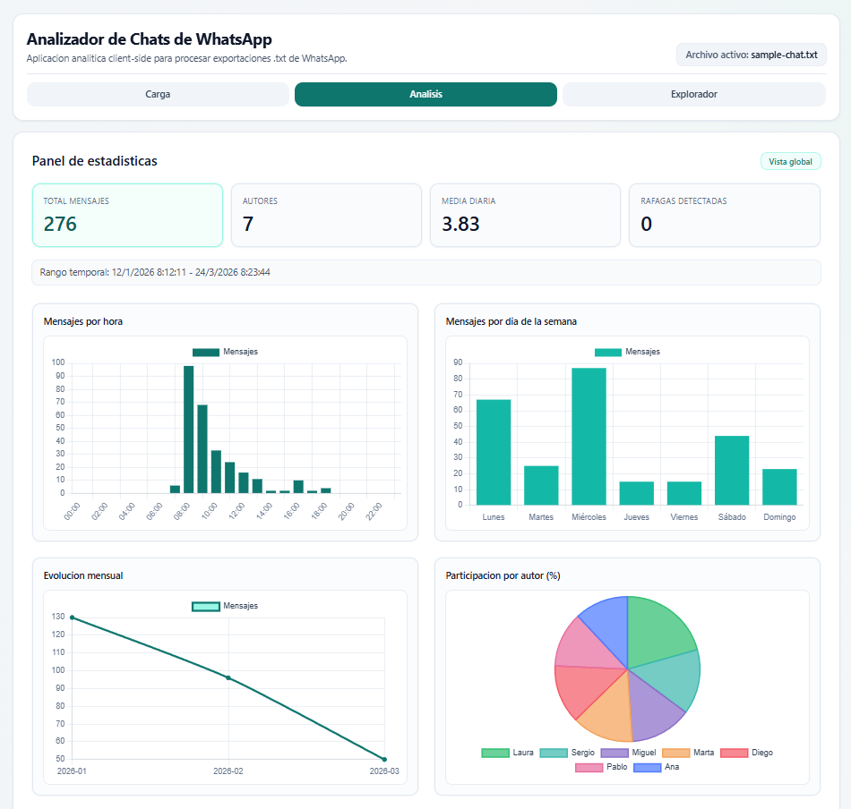

# WhatsApp Chat Analyzer (MVP)

Web app que analiza exportaciones `.txt` de chats de WhatsApp directamente en el navegador y genera estadísticas temporales, visualizaciones y recomendaciones de horarios óptimos de publicación.

Todo el procesamiento se realiza client-side, sin backend ni base de datos.

## Demo

Puedes probar la aplicación aquí:

https://whatsapp-chat-analyzer-ruby.vercel.app/

## Captura



---

## Stack

- Vite
- React
- TypeScript (strict mode)
- Tailwind CSS
- Chart.js + react-chartjs-2

---

## Características

- Procesamiento local de exportaciones de chat de WhatsApp
- Estadísticas temporales de actividad
- Visualizaciones interactivas
- Heatmap día × hora
- Distribución de actividad por autor
- Detección de ráfagas de mensajes
- Recomendación de ventanas horarias óptimas de publicación
- Explorador de conversación con filtros

---

## Formato de entrada soportado

El MVP soporta exportaciones de chat con el formato:

```text
[D/M/YY, H:MM:SS] Autor: Mensaje
```

El parser:

- detecta mensajes multilinea
- limpia caracteres invisibles comunes en exportaciones de WhatsApp
- preserva autor, timestamp y contenido completo del mensaje

---

## Dataset de ejemplo

Se incluye un archivo de chat de ejemplo para probar la aplicación:

`examples/sample-chat.txt`

Este archivo contiene una conversación ficticia generada únicamente para demostración y pruebas, sin datos personales reales.

---

## Métricas calculadas

- Total de mensajes
- Número de autores
- Rango de fechas
- Media de mensajes por día
- Mensajes por hora
- Mensajes por día de la semana
- Heatmap día × hora
- Evolución mensual
- Participación por autor
- Detección de ráfagas (5 mensajes en ≤5 minutos)

El orden semanal sigue el estándar lunes → domingo.

---

## Algoritmo de recomendación

El sistema estima las mejores ventanas horarias para publicar en el chat analizando la actividad histórica.

Proceso simplificado:

1. Actividad media por hora

```text
actividad_media_hora = mensajes_en_hora / dias_totales
```

2. Penalización anti-ráfaga

Una ráfaga se detecta cuando ocurren al menos 5 mensajes con intervalos ≤ 5 minutos.
Si una hora está dominada por este tipo de ráfaga corta, se aplica una penalización multiplicando el score por 0.6.

3. Score final por hora

```text
score = actividad_media_por_dia × dias_distintos_activos_en_hora × factor_anti_rafaga
```

4. Selección de ventanas

- ventana primaria: mayor score
- ventana secundaria: segunda mejor con al menos 2 horas de separación

---

## Explorador de conversación

El explorador permite filtrar mensajes por:

- autor (multi-select)
- rango de fechas
- día de la semana
- franja horaria
- búsqueda de texto

Los filtros solo afectan al listado de mensajes; el dashboard mantiene siempre las métricas globales.

---

## Arquitectura

La lógica analítica está separada de la interfaz:

```text
parser → parsea el archivo de chat
stats → calcula métricas agregadas
recommendation → estima ventanas óptimas
components → renderizan la interfaz
utils → utilidades puras
```

Esto permite mantener el procesamiento desacoplado de la UI.

---

## Ejecutar en local

Instalar dependencias:

```bash
npm install
```

Modo desarrollo:

```bash
npm run dev
```

Build de producción:

```bash
npm run build
npm run preview
```

---

## Future work

Posibles mejoras futuras:

- soporte de formatos alternativos de exportación de WhatsApp
- persistencia local (IndexedDB)
- exportación de reportes (PDF / CSV)
- modo PWA
- tests unitarios para parser y métricas
